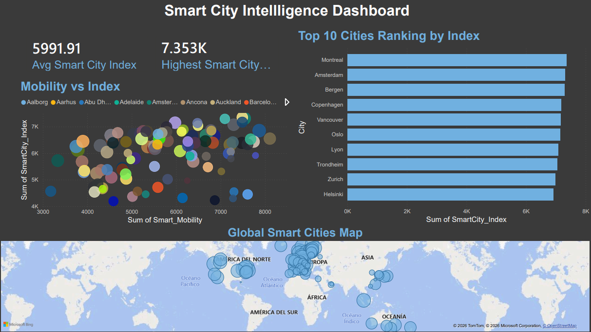
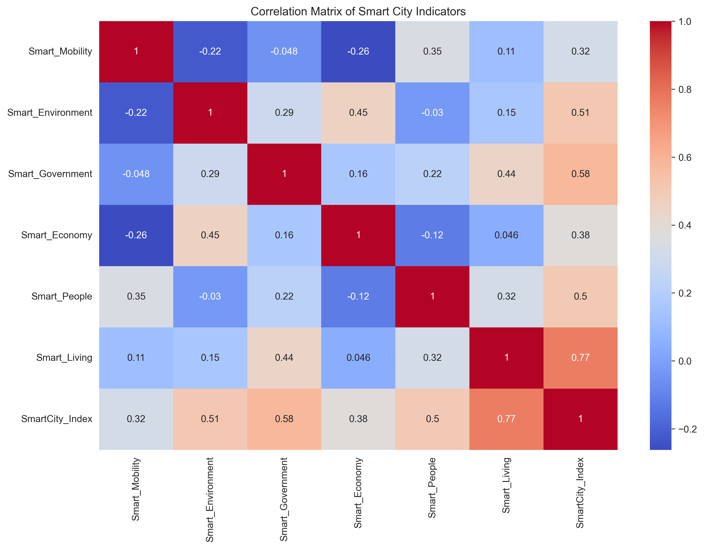
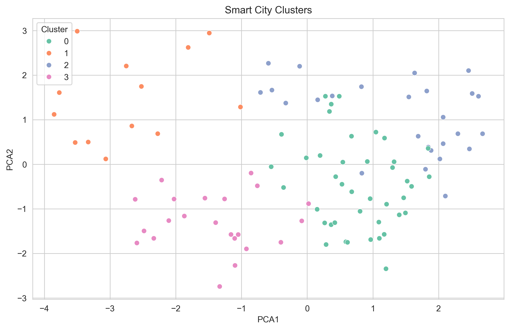
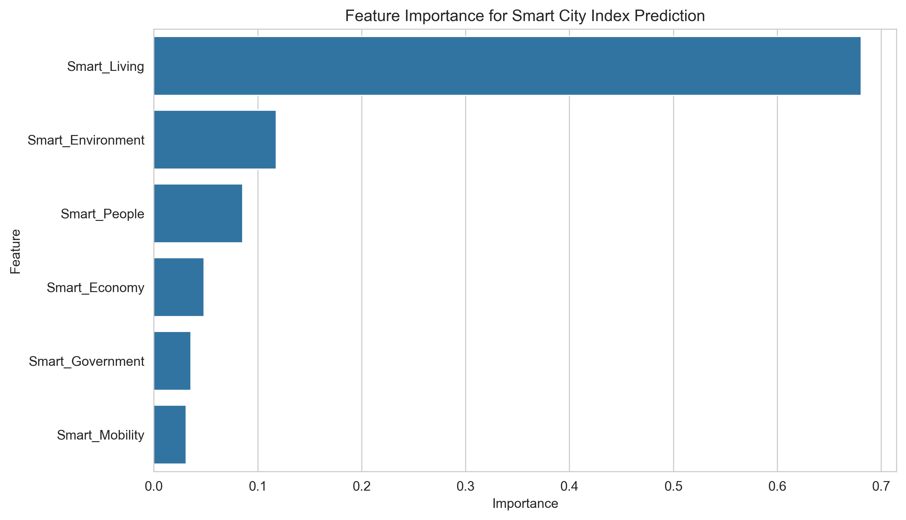

# 🏙️ Smart City Intelligence Analysis

<div align="center">


**Clustering, machine learning and feature analysis applied to global smart city performance data.**

</div>

---

## 📋 Table of Contents

- [Dashboard](#-Dashboard)
- [Overview](#-overview)
- [Dataset](#-dataset)
- [Project Structure](#-project-structure)
- [Project Workflow](#-project-workflow)
- [Key Insights](#-key-insights)
- [Model Performance](#-model-performance)
- [Visualizations](#-visualizations)
- [Technologies Used](#-technologies-used)
- [Future Improvements](#-future-improvements)
- [Author](#-author)

---
## Dashboard


## 🔍 Overview

This project explores global smart city performance using data analysis, clustering techniques, and machine learning models. The objective is to identify the key dimensions that contribute most strongly to smart city success and uncover patterns among high-performing cities worldwide.

---

## 📊 Dataset

The dataset contains smart city indicators for more than **100 cities worldwide**, including:

| Dimension | Description |
|---|---|
| Smart Mobility | Transportation and connectivity infrastructure |
| Smart Environment | Sustainability and environmental quality |
| Smart Government | Digital governance and public services |
| Smart Economy | Innovation, productivity and entrepreneurship |
| Smart People | Education, social inclusion and creativity |
| Smart Living | Quality of life and social cohesion |
| Smart City Index | Overall composite performance score |

---

## 📁 Project Structure

```
smart-city-intelligence-analysis/
├── data/
│   └── raw/                    ← original dataset
├── images/
│   ├── city_clusters.png
│   ├── correlation_heatmap.png
│   └── feature_importance.png
├── notebooks/
│   └── smart_city_analysis.ipynb   ← main analysis
├── src/
│   └── smart_city_analysis.py      ← modular script
├── .gitignore
├── LICENSE
├── README.md
└── requirements.txt
```

---

## 🔄 Project Workflow

### 1. Data Cleaning & Exploration
- Loaded and explored the dataset
- Checked data types and summary statistics
- Cleaned and standardized column names

### 2. Exploratory Data Analysis (EDA)
- Correlation analysis between smart city dimensions
- Heatmaps and distribution visualizations
- Statistical summaries per city cluster

### 3. Clustering Analysis
- Standardized features with `StandardScaler`
- Applied **PCA** for dimensionality reduction
- Used **KMeans** to group cities with similar smart city profiles

### 4. Machine Learning Model
- Built a **Random Forest Regressor** to predict Smart City Index scores
- Evaluated performance using:
  - Mean Absolute Error (MAE)
  - R² Score

### 5. Feature Importance Analysis
- Identified which smart city dimensions most strongly influence overall performance

---

## 💡 Key Insights

- **Smart Living** was the strongest predictor of overall Smart City Index performance.
- **Smart Mobility** showed lower predictive importance than expected.
- **Nordic cities** tended to dominate in government and environmental indicators.
- Different city clusters revealed **distinct development priorities** and urban strategies.

---

## 📈 Model Performance

| Metric | Value |
|---|---|
| Mean Absolute Error (MAE) | ~193 |
| R² Score | ~0.89 |

> The model explained approximately **89% of the variance** in smart city performance.

---

## 🖼️ Visualizations

### Correlation Heatmap


### Smart City Clusters


### Feature Importance


---

## 🛠️ Technologies Used

- **Python** — core language
- **Pandas & NumPy** — data manipulation
- **Matplotlib & Seaborn** — data visualization
- **Scikit-learn** — clustering, PCA and machine learning
- **Jupyter Notebook** — interactive development environment

---

## 🚀 Future Improvements

- Add interactive dashboards using **Plotly** or **Tableau**
- Include **time-series** smart city datasets for trend analysis
- Compare regional smart city strategies across continents
- Deploy as a **web dashboard** for public exploration

---

## 👤 Author

**César Adrián Cota Lugo**

[](https://github.com/cesarcota1)
